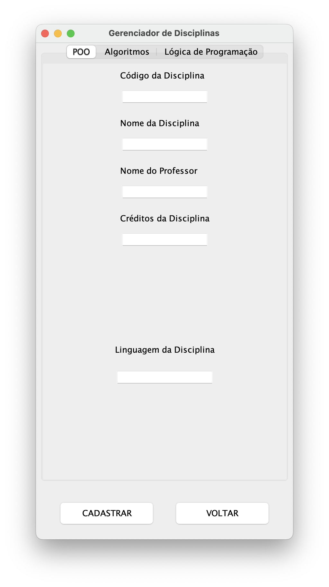

<h1 align="center">JavaSpring MVC Framework Project</h1>
<h2 align="center">Object-Oriented Programming - 2nd Semester of Software Engineering</h2>

    
    
    
    

## Overview
This project is a comprehensive case study of the **JavaSpring Framework** used for creating graphical user interfaces, implementing the **Model-View-Controller (MVC)** architectural pattern. Through this initiative, I enhanced my understanding of the separation of responsibilities among different components and the interaction between them.

## Key Learnings
- **Separation of Responsibilities:** Gained a deeper insight into dividing the system into distinct sections, each with its own role.
- **Advanced Java Features:** Enhanced my skills in utilizing Java's functions, lambda expressions, interfaces, and collections effectively.

---

Feel free to check out more details and continue exploring the functionalities of this project. Thank you for visiting!
